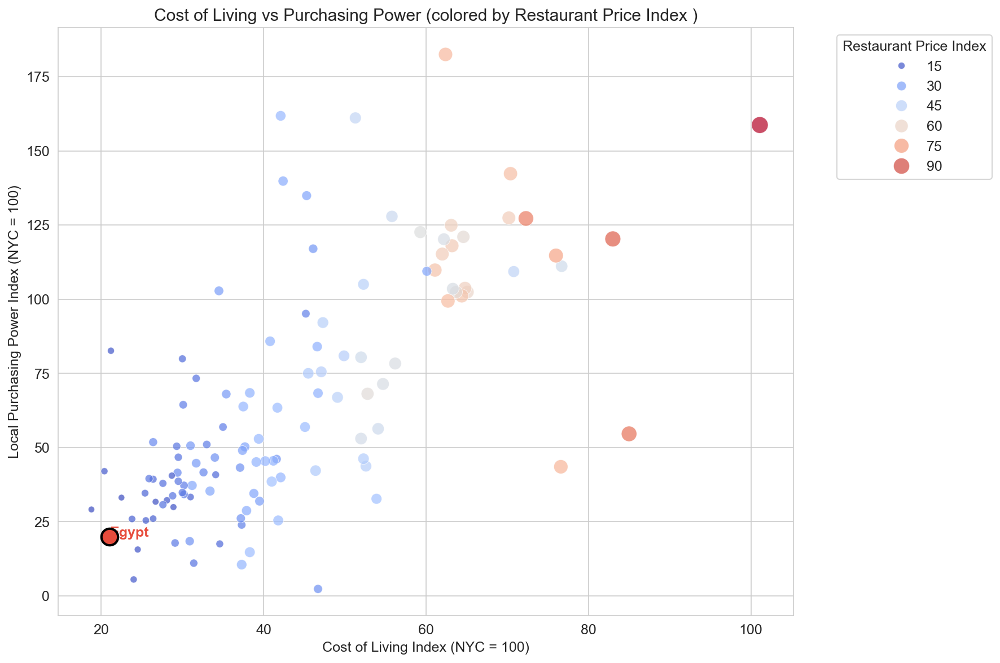
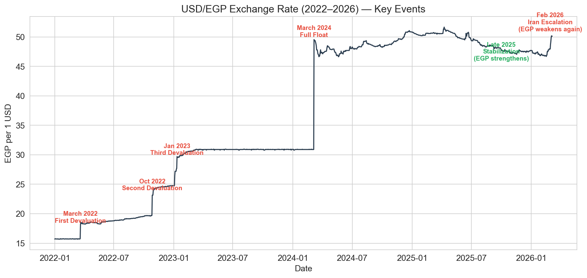
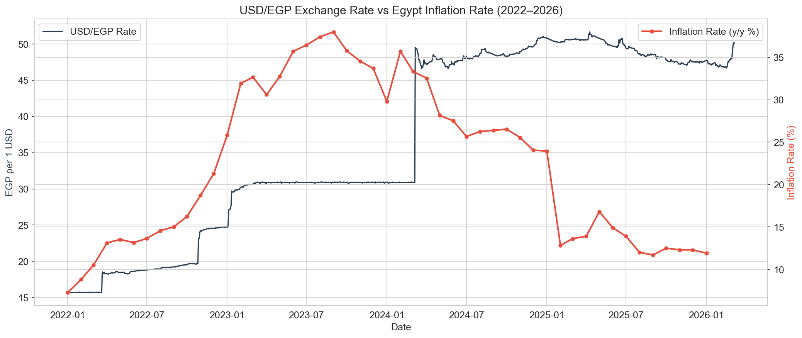

# Global Cost of Living Analysis: Where Does Your Money Go?

A data analysis project exploring global cost of living patterns with Egypt as the anchor point, including a deep dive into how currency devaluation and geopolitical events impact the Egyptian economy.

## Project Overview

This project analyzes cost of living data across 121 countries and 4,800+ cities to uncover which countries and cities offer the best (and worst) value for residents. The analysis narrows from a global view down to the MENA region, and finally into an Egypt-specific deep dive on currency volatility and inflation sensitivity.

All indices in the cost of living datasets are benchmarked against New York City (NYC = 100).

## Key Findings

- **Egypt ranks 3rd cheapest globally** by cost of living index, but its purchasing power score (20.0) is among the lowest in the world — cheap prices don't mean affordable living.

- **Gulf states dominate the MENA value rankings** — Kuwait, Oman, and Qatar offer residents 3-4x more value for their money than Egypt when factoring in what people actually earn.

- **Cairo's salary gap is severe** — at ~$202/month average salary, nearly the entire income goes to rent alone for a city center apartment ($197). Dubai's average salary is over 20x higher.

- **Currency devaluation and inflation are tightly linked** — the EGP lost over 200% of its value between 2022 and 2024, and inflation peaked at ~38% in late 2023.

- **Egypt's economy is highly sensitive to external shocks** — months of currency stabilization in late 2025 were reversed within days when the February 2026 Iran escalation disrupted Suez Canal traffic and halted energy imports.

## Sample Visuals

### Cost of Living vs Purchasing Power


### USD/EGP Exchange Rate with Key Events


### Exchange Rate vs Inflation


## Datasets

| Dataset | Source | Description |
|---------|--------|-------------|
| Cost of Living Index by Country (2024) | Numbeo via Kaggle | 121 countries, 6 indices |
| Global Cost of Living by City | Numbeo via Kaggle | 4,874 cities, 55 price items |
| USD/EGP Exchange Rate (2022–2026) | Investing.com | Daily exchange rate data |
| Egypt Monthly Inflation (2022–2026) | Central Bank of Egypt | Monthly year-over-year inflation |

## Project Structure

```
cost-of-living-analysis/
├── data/
│   ├── raw/
│   └── cleaned/
├── visuals/
├── notebook.ipynb
├── README.md
└── requirements.txt
```

## Tools Used

- Python (pandas, numpy, matplotlib, seaborn)
- Jupyter Notebook

## How to Run

1. Clone this repository
2. Install dependencies: `pip install -r requirements.txt`
3. Open `notebook.ipynb` and run all cells

## Limitations

- Cost of living data is a 2024 snapshot, not a time series
- City-level data is crowd-sourced and may contain biases toward cities with more contributors
- Inflation and exchange rate analysis shows correlation, not causation
- Salary data does not capture informal economy earnings

## Next Steps

- Build an interactive Tableau dashboard using the cleaned data
- Source historical cost of living data to track Egypt's price changes across multiple years
- Incorporate Suez Canal revenue data to quantify the impact of shipping disruptions
